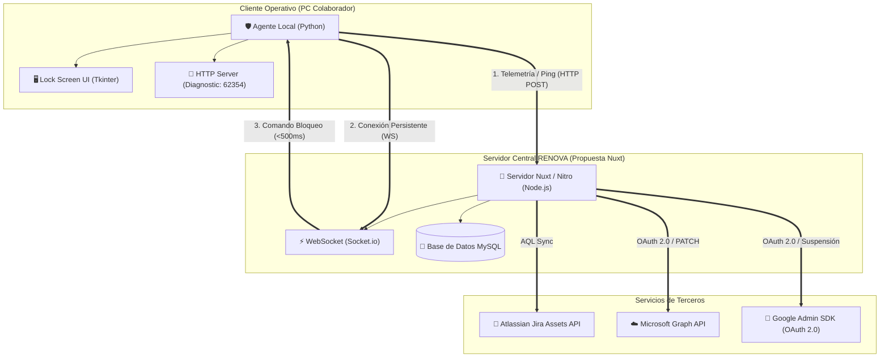
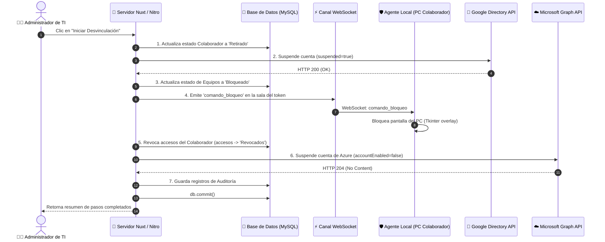

# Guía de Migración y Resumen Técnico: Directorio Activo RENOVA a Nuxt

Este documento resume de manera exhaustiva el funcionamiento del sistema actual de **Directorio Activo RENOVA** (construído originalmente en Flask + MySQL + Agente Local en Python) y proporciona un blueprint técnico detallado para su replicación en el framework **Nuxt (Vue.js + Node.js Nitro Backend)**.

---

## 📌 1. Arquitectura General del Sistema

El sistema actual opera bajo un modelo de control centralizado y comunicación bidireccional entre la Consola Web Administrativa y los Agentes de Seguridad locales instalados en las estaciones de trabajo:



### Canales de Comunicación

1. **Canal HTTP (Ping de Telemetría):** El agente local realiza consultas `POST` periódicas (cada 10 segundos por defecto) a la consola para reportar información de hardware, software instalado e IP local. La consola le responde con su estado y comandos pendientes (por ejemplo, si debe bloquearse).
2. **Canal WebSocket (Socket.IO):** Usado para comandos inmediatos de alta prioridad (como el bloqueo instantáneo del equipo). El agente se une a una "sala" (room) privada identificada por el token único de seguridad del dispositivo.
3. **Servidor HTTP Diagnóstico Local:** El agente local inicia un demonio HTTP en el puerto `62354`. Acceder a `http://localhost:62354` fuerza de manera inmediata un ping con reporte de inventario a la consola central (estilo GLPI on-demand).

---

## 💾 2. Estructura y Modelado de la Base de Datos (MySQL)

A continuación se detalla cómo estructurar las tablas usando el ORM **Prisma** para la migración a Nuxt:

### Esquema Prisma (`schema.prisma`)

```prisma
datasource db {
  provider = "mysql"
  url      = env("DATABASE_URL")
}

generator client {
  provider = "prisma-client-js"
}

// 1. Colaboradores
model Colaborador {
  id             Int               @id @default(autoincrement())
  nombre         String            @db.VarChar(100)
  correo         String            @unique @db.VarChar(100)
  jira_id        String?           @unique @db.VarChar(50) // Enlace con Jira Assets
  area           String            @db.VarChar(50)
  proyecto       String            @db.VarChar(50)
  estado         EstadoColaborador @default(Activo)
  creado_en      DateTime          @default(now())
  actualizado_en DateTime          @updatedAt
  
  equipos        Equipo[]
  accesos        Acceso[]

  @@map("colaboradores")
}

enum EstadoColaborador {
  Activo
  Inactivo
  Suspendido
  Vacaciones
  Retirado
}

// 2. Equipos y Activos Tecnológicos
model Equipo {
  id              Int                 @id @default(autoincrement())
  jira_id         String?             @db.VarChar(50) // ID de Jira Assets
  hostname        String              @unique @db.VarChar(50)
  mac_address     String?             @unique @db.VarChar(17)
  ip_registro     String?             @db.VarChar(45)
  marca_modelo    String?             @db.VarChar(100)
  estado          EstadoEquipo        @default(Disponible)
  token_seguridad String              @unique @db.VarChar(64) // Validación del agente
  colaborador_id  Int?
  colaborador     Colaborador?        @relation(fields: [colaborador_id], references: [id])
  actualizado_en  DateTime            @updatedAt
  ultimo_ping     DateTime?
  tipo_activo     String              @default("Portatil") @db.VarChar(50) // Celular, Monitor, Impresora, etc.
  
  // Especificaciones de Hardware (GLPI)
  so              String?             @db.VarChar(100)
  ram             String?             @db.VarChar(50)
  disco           String?             @db.VarChar(50)
  procesador      String?             @db.VarChar(100)
  serial          String?             @db.VarChar(50)
  
  programas       ProgramaInstalado[]

  @@map("equipos")
}

enum EstadoEquipo {
  Activo
  Inactivo
  Bloqueado
  Mantenimiento
  En_mantenimiento @map("En mantenimiento")
  Disponible
  Asignado
}

// 3. Programas Instalados (Auditoría GLPI de Software)
model ProgramaInstalado {
  id           Int      @id @default(autoincrement())
  equipo_id    Int
  equipo       Equipo   @relation(fields: [equipo_id], references: [id], onDelete: Cascade)
  nombre       String   @db.VarChar(150)
  version      String?  @db.VarChar(50)
  detectado_en DateTime @default(now())

  @@map("programas_instalados")
}

// 4. Catálogo de Aplicaciones
model Aplicacion {
  id          Int      @id @default(autoincrement())
  nombre      String   @unique @db.VarChar(50)
  descripcion String?  @db.VarChar(200)
  creado_en   DateTime @default(now())
  
  accesos     Acceso[]

  @@map("aplicaciones")
}

// 5. Matriz de Accesos (Relación Asociativa Colaborador - Aplicación)
model Acceso {
  id             Int          @id @default(autoincrement())
  colaborador_id Int
  colaborador    Colaborador  @relation(fields: [colaborador_id], references: [id])
  aplicacion_id  Int
  aplicacion     Aplicacion   @relation(fields: [aplicacion_id], references: [id])
  estado         EstadoAcceso @default(Activo)
  actualizado_en DateTime     @updatedAt

  @@map("accesos")
}

enum EstadoAcceso {
  Activo
  Revocado
}

// 6. Caché Local Google Workspace
model UsuarioGoogle {
  id                   Int       @id @default(autoincrement())
  google_id            String    @unique @db.VarChar(100)
  nombre               String    @db.VarChar(100)
  correo               String    @unique @db.VarChar(100)
  activo               Boolean   @default(true)
  area                 String?   @db.VarChar(100)
  ultimo_inicio_sesion DateTime?
  sincronizado_en      DateTime  @default(now()) @updatedAt

  @@map("usuarios_google")
}

// 7. Caché Local Microsoft 365
model UsuarioM365 {
  id                   Int       @id @default(autoincrement())
  user_id              String    @unique @db.VarChar(100)
  nombre               String    @db.VarChar(100)
  correo               String    @unique @db.VarChar(100)
  activo               Boolean   @default(true)
  licencias            String?   @db.Text // Separadas por coma
  ultimo_inicio_sesion DateTime?
  sincronizado_en      DateTime  @default(now()) @updatedAt

  @@map("usuarios_m365")
}

// 8. Historial de Auditoría
model Auditoria {
  id              Int      @id @default(autoincrement())
  accion          String   @db.VarChar(100)
  detalles        String?  @db.Text
  usuario_auditor String   @db.VarChar(100)
  fecha           DateTime @default(now())
  ip_origen       String?  @db.VarChar(45)

  @@map("auditoria")
}
```

---

## 🔌 3. Integración con Servicios de Terceros

El backend de Nuxt en Nitro implementará llamadas HTTPS utilizando `$fetch` o `axios` para gestionar los siguientes flujos externos:

### 📧 Google Workspace (Admin Directory API)

* **Objetivo:** Consultar el catálogo de correos corporativos y suspender cuentas de colaboradores desvinculados de forma remota.
* **Autenticación:** OAuth 2.0. El servidor inicia el redireccionamiento para obtener el consentimiento, guarda el token en un archivo local (`google_token.json` o en una variable en base de datos) y usa el `refresh_token` de manera automática cuando el `access_token` expira.
* **Acciones principales:**
  * Sincronizar directorio: Listado paginado de usuarios (`GET /users` con dominio o `customer=my_customer`).
  * Crear cuenta: `POST /users` con contraseña aleatoria y `changePasswordAtNextLogin: true`.
  * Suspender cuenta: `PATCH /users/{email}` con `{ "suspended": true }`.
  * Reactivar cuenta: `PATCH /users/{email}` con `{ "suspended": false }`.

### ☁️ Microsoft 365 (Microsoft Graph API)

* **Objetivo:** Deshabilitar cuentas de Azure Active Directory, revocar sesiones activas y administrar la asignación de licencias corporativas.
* **Autenticación:** OAuth 2.0 Client Credentials Flow (utilizando `MS_TENANT_ID`, `MS_CLIENT_ID` y `MS_CLIENT_SECRET`). No requiere intervención humana. Se solicita un token a `https://login.microsoftonline.com/{tenant_id}/oauth2/v2.0/token` con el scope `https://graph.microsoft.com/.default`.
* **Acciones principales:**
  * Consultar licencias contratadas en el Tenant: `GET /subscribedSkus`.
  * Cambiar estado de cuenta (Bloqueo): `PATCH /users/{user_id}` con `{ "accountEnabled": false }` (o `true` para restaurar).
  * Forzar cierre de sesiones (Revocación inmediata en Office/Teams): `POST /users/{user_id}/revokeSignInSessions`.
  * Asignar/Remover licencias: `POST /users/{user_id}/assignLicenses` indicando los SKU ID a añadir o quitar.

### 🎫 Atlassian Jira Service Desk (Jira Assets API)

* **Objetivo:** Sincronizar automáticamente el inventario de colaboradores y dispositivos de hardware registrados en los esquemas de soporte de Jira Assets.
* **Autenticación:** Basic Auth utilizando `JIRA_EMAIL` y `JIRA_API_TOKEN`.
* **Proceso de Autodetección de Workspace:**
  1. Consulta a `/rest/servicedeskapi/assets/workspace` para listar los workspaces de Assets de la cuenta.
  2. Valida cuál de ellos contiene el esquema (`JIRA_SCHEMA_ID`) haciendo una consulta AQL de prueba a `https://api.atlassian.com/jsm/assets/workspace/{w_id}/v1/object/aql` con query `objectSchemaId = {schema_id}`.
  3. Ejecuta la sincronización utilizando AQL paginado para obtener el listado.
* **Tipos de Activo Sincronizados:**
  * Colaboradores (para asociarlos en base de datos).
  * Activos tecnológicos corporativos (9 tipos): *Portatiles*, *Monitores*, *Celulares*, *Lineas*, *Impresoras*, *Televisores*, *Biometricos*, *Servidores* y *Computadores escritorio*.

---

## 🔒 4. Funcionamiento del Agente de Seguridad Local

> [!NOTE]
> El Agente de Seguridad local corre de forma independiente en Python en las computadoras de los colaboradores. **No requiere ser migrado a JavaScript**, pero el backend de Nuxt debe replicar exactamente la API HTTP y el servidor Socket.IO a los que este agente se conecta.

### 🔌 Canal HTTP (Ping e Inventariado)

* **Petición:** `POST /equipos/api/agente/ping`
* **Cuerpo enviado por el agente:**

  ```json
  {
    "token_seguridad": "uuid-del-equipo",
    "so": "Windows 10 Pro (Ver: 10.0.19045)",
    "procesador": "Intel Core i7-10700K CPU @ 3.80GHz",
    "ram": "16.0 GB",
    "disco": "512.0 GB",
    "programas": [
      { "nombre": "AnyDesk", "version": "7.1.13" },
      { "nombre": "Google Chrome", "version": "120.0.6099.110" }
    ]
  }
  ```

* **Respuesta del Servidor:**

  ```json
  {
    "hostname": "LAPTOP-TECNOLOGIA",
    "estado": "Asignado", // o "Bloqueado"
    "comando": "NINGUNO" // o "BLOQUEAR"
  }
  ```

### ⚡ Canal WebSocket (Socket.IO)

1. El agente se conecta al WebSocket y emite el evento `agente_registrar` enviando `{ "token": "token-seguridad-equipo" }`.
2. El servidor lo une a la sala identificada por su token: `socket.join(token)`.
3. Al gatillarse el bloqueo en el Asistente de Desvinculación, el servidor emite `comando_bloqueo` a esa sala con el mensaje de bloqueo.
4. Al recibir el comando, el agente levanta una interfaz en Tkinter a pantalla completa, captura el foco del sistema operativo y deshabilita cierres como Alt+F4. Requiere ingresar el PIN de desbloqueo offline definido en el archivo `config.json` local del agente.

---

## 🔄 5. Flujo Crítico: Asistente de Desvinculación (Offboarding Wizard)

El flujo que orquesta la baja inmediata de un colaborador y la recuperación de activos ejecuta los siguientes pasos secuenciales:



---

## 🚀 6. Blueprint de Migración a Nuxt

### Mapeo de Controladores de Flask a Rutas de Nuxt

| Flask Controller / Endpoint | Tipo | Nuxt Page Route (Frontend) | Nuxt Server API Route (Nitro Backend) |
| :--- | :--- | :--- | :--- |
| `/` | `GET` | `pages/index.vue` (Dashboard) | `/server/api/dashboard/stats.get.ts` |
| `/colaboradores/` | `GET` | `pages/colaboradores/index.vue` | `/server/api/colaboradores/index.get.ts` |
| `/colaboradores/crear` | `POST` | (Formulario en modal o página) | `/server/api/colaboradores/create.post.ts` |
| `/equipos/` | `GET` | `pages/equipos/index.vue` | `/server/api/equipos/index.get.ts` |
| `/equipos/api/agente/ping` | `POST` | *N/A* (Usado por el agente) | `/server/api/equipos/ping.post.ts` |
| `/aplicaciones/` | `GET` | `pages/aplicaciones/index.vue` | `/server/api/aplicaciones/index.get.ts` |
| `/desvinculacion/<id>` | `GET` | `pages/desvinculacion/wizard/[id].vue` | `/server/api/desvinculacion/wizard/[id].get.ts` |
| `/desvinculacion/api/iniciar/<id>` | `POST` | *N/A* (Botón de acción) | `/server/api/desvinculacion/iniciar/[id].post.ts` |
| `/google/admin` | `GET` | `pages/google/admin.vue` | `/server/api/google/users.get.ts` |
| `/google/api/sincronizar` | `POST` | *N/A* (Botón de acción) | `/server/api/google/sincronizar.post.ts` |
| `/microsoft/admin` | `GET` | `pages/microsoft/admin.vue` | `/server/api/microsoft/users.get.ts` |
| `/microsoft/api/sincronizar` | `POST` | *N/A* (Botón de acción) | `/server/api/microsoft/sincronizar.post.ts` |
| `/jira/api/sincronizar` | `POST` | *N/A* (Sincronización manual/cron) | `/server/api/jira/sincronizar.post.ts` |
| `/auditorias/` | `GET` | `pages/auditorias/index.vue` | `/server/api/auditorias/index.get.ts` |

### Integración de WebSocket (Socket.io) en Nuxt 3

Para implementar WebSockets en Nuxt 3 usando el servidor Nitro (Node.js), se recomienda crear un plugin de servidor en Nitro para inyectar la instancia de Socket.io sobre el servidor HTTP nativo.

#### Ejemplo de Plugin de Servidor Nitro (`/server/plugins/socketio.ts`)

```typescript
import { Server } from 'socket.io'
import { defineNitroPlugin } from 'nitropack/dist/runtime/plugin'

export default defineNitroPlugin((nitroApp) => {
  // Solo se ejecuta en el servidor en caliente/producción de Node.js
  nitroApp.router.use('/socket.io', () => {}) // placeholder para la ruta de socket.io

  // Hook del servidor HTTP de Nitro para instanciar Socket.io
  nitroApp.hooks.hook('request', (event) => {
    // Si la instancia del servidor no está vinculada, se vincula
    const rawServer = (event.node.req.socket as any).server
    if (rawServer && !rawServer._io) {
      const io = new Server(rawServer, {
        cors: {
          origin: '*',
          methods: ['GET', 'POST']
        }
      })
      
      rawServer._io = io

      io.on('connection', (socket) => {
        console.log(`[SOCKET] Cliente conectado: ${socket.id}`)

        socket.on('agente_registrar', (data) => {
          const token = data?.token
          if (token) {
            socket.join(token)
            console.log(`[SOCKET] Agente con token '${token.substring(0, 8)}...' registrado.`)
            socket.emit('confirmacion', {
              mensaje: 'Agente registrado correctamente en el canal seguro.',
              sala: token
            })
          }
        })

        socket.on('disconnect', () => {
          console.log(`[SOCKET] Cliente desconectado: ${socket.id}`)
        })
      })
    }
  })
})
```

#### Emitir evento desde un endpoint de Nitro (Ej: `iniciar.post.ts`)

```typescript
// Para enviar un bloqueo en tiempo real dentro de una API de Nitro:
export default defineEventHandler(async (event) => {
  const io = (event.node.req.socket as any).server._io
  if (io) {
    io.to(equipo.token_seguridad).emit('comando_bloqueo', {
      evento: 'comando_bloqueo',
      hostname: equipo.hostname,
      mensaje: 'Su equipo ha sido bloqueado por el Departamento de Tecnología.',
      timestamp: new Date().toISOString()
    })
  }
})
```

### 🎨 7. Replicación del Diseño Visual (Glassmorphism & Purple Identity)

Para conservar la identidad visual RENOVA en Vue, puedes declarar estas variables globales en tu hoja de estilos principal (`assets/css/style.css` o `index.css` cargado en `nuxt.config.ts`):

```css
:root {
  --font-family: 'Outfit', 'Inter', sans-serif;
  --bg-main: #f1f5f9;
  --bg-glass: rgba(255, 255, 255, 0.75);
  --border-glass: rgba(255, 255, 255, 0.3);
  --shadow-glass: 0 8px 32px 0 rgba(31, 38, 135, 0.05);
  
  --accent-primary: #7C3AED;   /* Morado RENOVA */
  --accent-secondary: #2563EB; /* Azul corporativo */
  
  --color-success: #22c55e;
  --color-warning: #F59E0B;
  --color-danger: #ef4444;
}

body {
  background-color: var(--bg-main);
  font-family: var(--font-family);
  margin: 0;
}

/* Tarjeta Glassmorphism */
.glass-card {
  background: var(--bg-glass);
  backdrop-filter: blur(16px);
  -webkit-backdrop-filter: blur(16px);
  border: 1px solid var(--border-glass);
  border-radius: 16px;
  box-shadow: var(--shadow-glass);
}
```

---

## 🛠️ 8. Plan de Implementación Sugerido para la Migración

1. **Paso 1: Inicialización del Proyecto Nuxt**
   * Ejecutar `npx nuxi@latest init directorio-activo-nuxt`.
   * Instalar Prisma (`npm install @prisma/client` & `npm install prisma --save-dev`).
   * Crear el archivo `.env` configurando la base de datos MySQL existente e inicializar Prisma con `npx prisma db pull` (para leer la base de datos existente) o crear el esquema arriba especificado y correr `npx prisma db push`.

2. **Paso 2: Rutas de API del Agente**
   * Implementar el endpoint `POST /server/api/equipos/ping.post.ts` para que los agentes en producción no pierdan conexión con el servidor.

3. **Paso 3: WebSocket**
   * Agregar el plugin de Socket.io en Nitro para re-habilitar el canal seguro de envío de comandos.

4. **Paso 4: Integración externa de APIs**
   * Re-escribir las utilidades de integración para Google SDK, Microsoft Graph y Jira Assets en TypeScript/Node.js dentro de `/server/utils/`.

5. **Paso 5: Vistas e Interfaces de Usuario**
   * Diseñar las páginas usando componentes Vue reactivos y el sistema de variables de diseño RENOVA.
   * Implementar el asistente interactivo (Wizard) de desvinculación.
